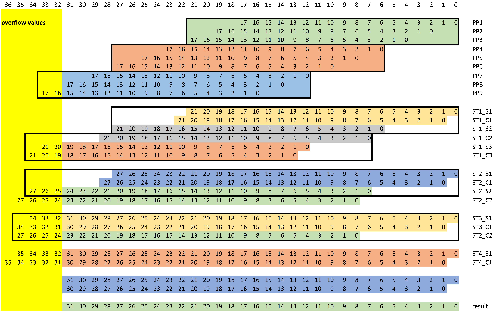

# Radix4_Booth_Multiplier

## 1. Algorithm
<font size=4>
According to the function of Radix-4 Booth Multiplier, we can find that a 16-bit value A can be:
</font>

:(2{\times}i-1)],%202{\times}i))

%20=%20(-2{\times}A[i+1]+A[i]+A[i-1])\times2^k)

<font size=4>
Appling the function above to A times B, then we can find:
</font>

:(2{\times}i-1)],%202{\times}i))

<font size=4>
Then there will be 9 partial values and we can use Wallace tree to get the fianl product as below:
</font>
<br>



## 2. Design Code

<font size=4>
The overall design will look like this:
</font>

```bash
multiplier.v
├─booth_16x16.v
└─wtree_16x16.v
    ├─full_adder.v
    └─half_adder.v
```

<font size=3>
multiplier.v
</font>

```verilog
module multiplier(A, B, M, clk, rst_n);
      parameter width = 16;
      input                     clk, rst_n;
      input  wire [width-1:0]   A, B;
      output wire [2*width-1:0] M;

      wire [17:0] pp1, pp2, pp3, pp4, pp5, pp6, pp7, pp8, pp9;
      wire [31:0] final_p;

      booth_16x16 U_BOOTH_16X16(
            .i_multa (A  ),
            .i_multb (B  ),
            .o_pp1   (pp1),
            .o_pp2   (pp2),
            .o_pp3   (pp3),
            .o_pp4   (pp4),
            .o_pp5   (pp5),
            .o_pp6   (pp6),
            .o_pp7   (pp7),
            .o_pp8   (pp8),
            .o_pp9   (pp9) 
            );

      wtree_16x16 U_WTREE_16X16(
            .clk     (clk  ),
            .rst_n   (rst_n),
            .pp1     (pp1  ),
            .pp2     (pp2  ),
            .pp3     (pp3  ),
            .pp4     (pp4  ),
            .pp5     (pp5  ),
            .pp6     (pp6  ),
            .pp7     (pp7  ),
            .pp8     (pp8  ),
            .pp9     (pp9  ),
            .final_p (M    )
            );

      assign M = final_p[31:0];

endmodule
```

<font size=3>
booth_16x16.v
</font>

```verilog
module booth_16x16(
      input  wire [15:0] i_multa,
      input  wire [15:0] i_multb,
      output wire [17:0] o_pp1  ,
      output wire [17:0] o_pp2  ,
      output wire [17:0] o_pp3  ,
      output wire [17:0] o_pp4  ,
      output wire [17:0] o_pp5  ,
      output wire [17:0] o_pp6  ,
      output wire [17:0] o_pp7  ,
      output wire [17:0] o_pp8  ,
      output wire [17:0] o_pp9 
      );

      // sign bit extend
      wire [1:0] sig_exta = {2{i_multa[15]}};
      wire [1:0] sig_extb = {2{i_multb[15]}};

      // 6 = 4'b0110, -6 = 4'b1010, ~(0110) + 1 = 1010, ~(1010) + 1 = 0110, complement code can be neg value
      // -6=4'b1010, 5'b10100: sign=1, value=~(0100)+1=1011+1=1100, complement code can times 2 by shift left
      // generat -x, -2x, 2x for Booth encoding
      wire [17:0] x     = {sig_exta, i_multa};
      wire [17:0] x_c   = ~x + 1;   // -x
      wire [17:0] xm2   = x << 1;   // 2*x
      wire [17:0] x_cm2 = x_c << 1; // -2*x

      //        18 17         [16 15 14 13 12 11 10 9 8 7 6 5 4 3 2 1]     0  
      //        |---|          |------------------------------------|      |
      // extended sign bits              orignal operator             appended bit for encoding
      wire [18:0] y     =  {sig_extb, i_multb, 1'b0};

      // calculating partial product based on Booth Radix-4 encoding
      wire [17:0] pp[8:0];
      generate
            genvar i;
            for(i=0; i<18; i=i+2)
            begin : GEN_PP
                  assign pp[i/2] = (y[i+2:i] == 3'b001 || y[i+2:i] == 3'b010) ? x     :
                                   (y[i+2:i] == 3'b101 || y[i+2:i] == 3'b110) ? x_c   :
                                   (y[i+2:i] == 3'b011                      ) ? xm2   :
                                   (y[i+2:i] == 3'b100                      ) ? x_cm2 : 18'b0;
            end
      endgenerate

      assign o_pp1   = pp[0];
      assign o_pp2   = pp[1];
      assign o_pp3   = pp[2];
      assign o_pp4   = pp[3];
      assign o_pp5   = pp[4];
      assign o_pp6   = pp[5];
      assign o_pp7   = pp[6];
      assign o_pp8   = pp[7];
      assign o_pp9   = pp[8];

endmodule
```

<font size=3>
wtree_16x16.v
</font>

```verilog
module wtree_16x16(
      input  wire        clk  ,
      input  wire        rst_n,
      input  wire [17:0] pp1  , 
      input  wire [17:0] pp2  , 
      input  wire [17:0] pp3  , 
      input  wire [17:0] pp4  , 
      input  wire [17:0] pp5  , 
      input  wire [17:0] pp6  , 
      input  wire [17:0] pp7  , 
      input  wire [17:0] pp8  , 
      input  wire [17:0] pp9  , 
      output wire [31:0] final_p
      );


      // ================ first stage ================
      wire [21:0] stg1_s1, stg1_c1;
      wire [21:0] stg1_s2, stg1_c2;
      wire [19:0] stg1_s3, stg1_c3;

      assign stg1_s1[1:0]   = pp1[1:0];
      assign stg1_c1[1:0]   = 2'b0;
      half_adder u_a11_2 (.a(pp1[ 2]), .b(pp2[ 0]),               .s(stg1_s1[ 2]), .co(stg1_c1[ 2]));
      half_adder u_a11_3 (.a(pp1[ 3]), .b(pp2[ 1]),               .s(stg1_s1[ 3]), .co(stg1_c1[ 3]));
      full_adder u_a11_4 (.a(pp1[ 4]), .b(pp2[ 2]), .ci(pp3[ 0]), .s(stg1_s1[ 4]), .co(stg1_c1[ 4]));
      full_adder u_a11_5 (.a(pp1[ 5]), .b(pp2[ 3]), .ci(pp3[ 1]), .s(stg1_s1[ 5]), .co(stg1_c1[ 5]));
      full_adder u_a11_6 (.a(pp1[ 6]), .b(pp2[ 4]), .ci(pp3[ 2]), .s(stg1_s1[ 6]), .co(stg1_c1[ 6]));
      full_adder u_a11_7 (.a(pp1[ 7]), .b(pp2[ 5]), .ci(pp3[ 3]), .s(stg1_s1[ 7]), .co(stg1_c1[ 7]));
      full_adder u_a11_8 (.a(pp1[ 8]), .b(pp2[ 6]), .ci(pp3[ 4]), .s(stg1_s1[ 8]), .co(stg1_c1[ 8]));
      full_adder u_a11_9 (.a(pp1[ 9]), .b(pp2[ 7]), .ci(pp3[ 5]), .s(stg1_s1[ 9]), .co(stg1_c1[ 9]));
      full_adder u_a11_10(.a(pp1[10]), .b(pp2[ 8]), .ci(pp3[ 6]), .s(stg1_s1[10]), .co(stg1_c1[10]));
      full_adder u_a11_11(.a(pp1[11]), .b(pp2[ 9]), .ci(pp3[ 7]), .s(stg1_s1[11]), .co(stg1_c1[11]));
      full_adder u_a11_12(.a(pp1[12]), .b(pp2[10]), .ci(pp3[ 8]), .s(stg1_s1[12]), .co(stg1_c1[12]));
      full_adder u_a11_13(.a(pp1[13]), .b(pp2[11]), .ci(pp3[ 9]), .s(stg1_s1[13]), .co(stg1_c1[13]));
      full_adder u_a11_14(.a(pp1[14]), .b(pp2[12]), .ci(pp3[10]), .s(stg1_s1[14]), .co(stg1_c1[14]));
      full_adder u_a11_15(.a(pp1[15]), .b(pp2[13]), .ci(pp3[11]), .s(stg1_s1[15]), .co(stg1_c1[15]));
      full_adder u_a11_16(.a(pp1[16]), .b(pp2[14]), .ci(pp3[12]), .s(stg1_s1[16]), .co(stg1_c1[16]));
      full_adder u_a11_17(.a(pp1[17]), .b(pp2[15]), .ci(pp3[13]), .s(stg1_s1[17]), .co(stg1_c1[17]));
      full_adder u_a11_18(.a(pp1[17]), .b(pp2[16]), .ci(pp3[14]), .s(stg1_s1[18]), .co(stg1_c1[18]));
      full_adder u_a11_19(.a(pp1[17]), .b(pp2[17]), .ci(pp3[15]), .s(stg1_s1[19]), .co(stg1_c1[19]));
      full_adder u_a11_20(.a(pp1[17]), .b(pp2[17]), .ci(pp3[16]), .s(stg1_s1[20]), .co(stg1_c1[20]));
      full_adder u_a11_21(.a(pp1[17]), .b(pp2[17]), .ci(pp3[17]), .s(stg1_s1[21]), .co(stg1_c1[21]));

      assign stg1_s2[1:0]   = pp4[1:0];
      assign stg1_c2[1:0]   = 2'b0;
      half_adder u_a12_2 (.a(pp4[ 2]), .b(pp5[ 0]),               .s(stg1_s2[ 2]), .co(stg1_c2[ 2]));
      half_adder u_a12_3 (.a(pp4[ 3]), .b(pp5[ 1]),               .s(stg1_s2[ 3]), .co(stg1_c2[ 3]));
      full_adder u_a12_4 (.a(pp4[ 4]), .b(pp5[ 2]), .ci(pp6[ 0]), .s(stg1_s2[ 4]), .co(stg1_c2[ 4]));
      full_adder u_a12_5 (.a(pp4[ 5]), .b(pp5[ 3]), .ci(pp6[ 1]), .s(stg1_s2[ 5]), .co(stg1_c2[ 5]));
      full_adder u_a12_6 (.a(pp4[ 6]), .b(pp5[ 4]), .ci(pp6[ 2]), .s(stg1_s2[ 6]), .co(stg1_c2[ 6]));
      full_adder u_a12_7 (.a(pp4[ 7]), .b(pp5[ 5]), .ci(pp6[ 3]), .s(stg1_s2[ 7]), .co(stg1_c2[ 7]));
      full_adder u_a12_8 (.a(pp4[ 8]), .b(pp5[ 6]), .ci(pp6[ 4]), .s(stg1_s2[ 8]), .co(stg1_c2[ 8]));
      full_adder u_a12_9 (.a(pp4[ 9]), .b(pp5[ 7]), .ci(pp6[ 5]), .s(stg1_s2[ 9]), .co(stg1_c2[ 9]));
      full_adder u_a12_10(.a(pp4[10]), .b(pp5[ 8]), .ci(pp6[ 6]), .s(stg1_s2[10]), .co(stg1_c2[10]));
      full_adder u_a12_11(.a(pp4[11]), .b(pp5[ 9]), .ci(pp6[ 7]), .s(stg1_s2[11]), .co(stg1_c2[11]));
      full_adder u_a12_12(.a(pp4[12]), .b(pp5[10]), .ci(pp6[ 8]), .s(stg1_s2[12]), .co(stg1_c2[12]));
      full_adder u_a12_13(.a(pp4[13]), .b(pp5[11]), .ci(pp6[ 9]), .s(stg1_s2[13]), .co(stg1_c2[13]));
      full_adder u_a12_14(.a(pp4[14]), .b(pp5[12]), .ci(pp6[10]), .s(stg1_s2[14]), .co(stg1_c2[14]));
      full_adder u_a12_15(.a(pp4[15]), .b(pp5[13]), .ci(pp6[11]), .s(stg1_s2[15]), .co(stg1_c2[15]));
      full_adder u_a12_16(.a(pp4[16]), .b(pp5[14]), .ci(pp6[12]), .s(stg1_s2[16]), .co(stg1_c2[16]));
      full_adder u_a12_17(.a(pp4[17]), .b(pp5[15]), .ci(pp6[13]), .s(stg1_s2[17]), .co(stg1_c2[17]));
      full_adder u_a12_18(.a(pp4[17]), .b(pp5[16]), .ci(pp6[14]), .s(stg1_s2[18]), .co(stg1_c2[18]));
      full_adder u_a12_19(.a(pp4[17]), .b(pp5[17]), .ci(pp6[15]), .s(stg1_s2[19]), .co(stg1_c2[19]));
      full_adder u_a12_20(.a(pp4[17]), .b(pp5[17]), .ci(pp6[16]), .s(stg1_s2[20]), .co(stg1_c2[20]));
      full_adder u_a12_21(.a(pp4[17]), .b(pp5[17]), .ci(pp6[17]), .s(stg1_s2[21]), .co(stg1_c2[21]));

      assign stg1_s3[1:0]   = pp7[1:0];
      assign stg1_c3[1:0]   = 2'b0;
      half_adder u_a13_2 (.a(pp7[ 2]), .b(pp8[ 0]),               .s(stg1_s3[ 2]), .co(stg1_c3[ 2]));
      half_adder u_a13_3 (.a(pp7[ 3]), .b(pp8[ 1]),               .s(stg1_s3[ 3]), .co(stg1_c3[ 3]));
      full_adder u_a13_4 (.a(pp7[ 4]), .b(pp8[ 2]), .ci(pp9[ 0]), .s(stg1_s3[ 4]), .co(stg1_c3[ 4]));
      full_adder u_a13_5 (.a(pp7[ 5]), .b(pp8[ 3]), .ci(pp9[ 1]), .s(stg1_s3[ 5]), .co(stg1_c3[ 5]));
      full_adder u_a13_6 (.a(pp7[ 6]), .b(pp8[ 4]), .ci(pp9[ 2]), .s(stg1_s3[ 6]), .co(stg1_c3[ 6]));
      full_adder u_a13_7 (.a(pp7[ 7]), .b(pp8[ 5]), .ci(pp9[ 3]), .s(stg1_s3[ 7]), .co(stg1_c3[ 7]));
      full_adder u_a13_8 (.a(pp7[ 8]), .b(pp8[ 6]), .ci(pp9[ 4]), .s(stg1_s3[ 8]), .co(stg1_c3[ 8]));
      full_adder u_a13_9 (.a(pp7[ 9]), .b(pp8[ 7]), .ci(pp9[ 5]), .s(stg1_s3[ 9]), .co(stg1_c3[ 9]));
      full_adder u_a13_10(.a(pp7[10]), .b(pp8[ 8]), .ci(pp9[ 6]), .s(stg1_s3[10]), .co(stg1_c3[10]));
      full_adder u_a13_11(.a(pp7[11]), .b(pp8[ 9]), .ci(pp9[ 7]), .s(stg1_s3[11]), .co(stg1_c3[11]));
      full_adder u_a13_12(.a(pp7[12]), .b(pp8[10]), .ci(pp9[ 8]), .s(stg1_s3[12]), .co(stg1_c3[12]));
      full_adder u_a13_13(.a(pp7[13]), .b(pp8[11]), .ci(pp9[ 9]), .s(stg1_s3[13]), .co(stg1_c3[13]));
      full_adder u_a13_14(.a(pp7[14]), .b(pp8[12]), .ci(pp9[10]), .s(stg1_s3[14]), .co(stg1_c3[14]));
      full_adder u_a13_15(.a(pp7[15]), .b(pp8[13]), .ci(pp9[11]), .s(stg1_s3[15]), .co(stg1_c3[15]));
      full_adder u_a13_16(.a(pp7[16]), .b(pp8[14]), .ci(pp9[12]), .s(stg1_s3[16]), .co(stg1_c3[16]));
      full_adder u_a13_17(.a(pp7[17]), .b(pp8[15]), .ci(pp9[13]), .s(stg1_s3[17]), .co(stg1_c3[17]));
      full_adder u_a13_18(.a(pp7[17]), .b(pp8[16]), .ci(pp9[14]), .s(stg1_s3[18]), .co(stg1_c3[18]));
      full_adder u_a13_19(.a(pp7[17]), .b(pp8[17]), .ci(pp9[15]), .s(stg1_s3[19]), .co(stg1_c3[19]));


      //================ second stage ================
      wire [27:0] stg2_s1, stg2_c1;
      wire [24:0] stg2_s2, stg2_c2;

      assign stg2_s1[0] = stg1_s1[0];
      assign stg2_c1[0] = 1'b0; 
      half_adder u_a21_1 (.a(stg1_s1[ 1]), .b(stg1_c1[ 0]),                   .s(stg2_s1[ 1]), .co(stg2_c1[ 1]));
      half_adder u_a21_2 (.a(stg1_s1[ 2]), .b(stg1_c1[ 1]),                   .s(stg2_s1[ 2]), .co(stg2_c1[ 2]));
      half_adder u_a21_3 (.a(stg1_s1[ 3]), .b(stg1_c1[ 2]),                   .s(stg2_s1[ 3]), .co(stg2_c1[ 3]));
      half_adder u_a21_4 (.a(stg1_s1[ 4]), .b(stg1_c1[ 3]),                   .s(stg2_s1[ 4]), .co(stg2_c1[ 4]));
      half_adder u_a21_5 (.a(stg1_s1[ 5]), .b(stg1_c1[ 4]),                   .s(stg2_s1[ 5]), .co(stg2_c1[ 5]));
      full_adder u_a21_6 (.a(stg1_s1[ 6]), .b(stg1_c1[ 5]), .ci(stg1_s2[ 0]), .s(stg2_s1[ 6]), .co(stg2_c1[ 6]));
      full_adder u_a21_7 (.a(stg1_s1[ 7]), .b(stg1_c1[ 6]), .ci(stg1_s2[ 1]), .s(stg2_s1[ 7]), .co(stg2_c1[ 7]));
      full_adder u_a21_8 (.a(stg1_s1[ 8]), .b(stg1_c1[ 7]), .ci(stg1_s2[ 2]), .s(stg2_s1[ 8]), .co(stg2_c1[ 8]));
      full_adder u_a21_9 (.a(stg1_s1[ 9]), .b(stg1_c1[ 8]), .ci(stg1_s2[ 3]), .s(stg2_s1[ 9]), .co(stg2_c1[ 9]));
      full_adder u_a21_10(.a(stg1_s1[10]), .b(stg1_c1[ 9]), .ci(stg1_s2[ 4]), .s(stg2_s1[10]), .co(stg2_c1[10]));
      full_adder u_a21_11(.a(stg1_s1[11]), .b(stg1_c1[10]), .ci(stg1_s2[ 5]), .s(stg2_s1[11]), .co(stg2_c1[11]));
      full_adder u_a21_12(.a(stg1_s1[12]), .b(stg1_c1[11]), .ci(stg1_s2[ 6]), .s(stg2_s1[12]), .co(stg2_c1[12]));
      full_adder u_a21_13(.a(stg1_s1[13]), .b(stg1_c1[12]), .ci(stg1_s2[ 7]), .s(stg2_s1[13]), .co(stg2_c1[13]));
      full_adder u_a21_14(.a(stg1_s1[14]), .b(stg1_c1[13]), .ci(stg1_s2[ 8]), .s(stg2_s1[14]), .co(stg2_c1[14]));
      full_adder u_a21_15(.a(stg1_s1[15]), .b(stg1_c1[14]), .ci(stg1_s2[ 9]), .s(stg2_s1[15]), .co(stg2_c1[15]));
      full_adder u_a21_16(.a(stg1_s1[16]), .b(stg1_c1[15]), .ci(stg1_s2[10]), .s(stg2_s1[16]), .co(stg2_c1[16]));
      full_adder u_a21_17(.a(stg1_s1[17]), .b(stg1_c1[16]), .ci(stg1_s2[11]), .s(stg2_s1[17]), .co(stg2_c1[17]));
      full_adder u_a21_18(.a(stg1_s1[18]), .b(stg1_c1[17]), .ci(stg1_s2[12]), .s(stg2_s1[18]), .co(stg2_c1[18]));
      full_adder u_a21_19(.a(stg1_s1[19]), .b(stg1_c1[18]), .ci(stg1_s2[13]), .s(stg2_s1[19]), .co(stg2_c1[19]));
      full_adder u_a21_20(.a(stg1_s1[20]), .b(stg1_c1[19]), .ci(stg1_s2[14]), .s(stg2_s1[20]), .co(stg2_c1[20]));
      full_adder u_a21_21(.a(stg1_s1[21]), .b(stg1_c1[20]), .ci(stg1_s2[15]), .s(stg2_s1[21]), .co(stg2_c1[21]));
      full_adder u_a21_22(.a(stg1_s1[21]), .b(stg1_c1[21]), .ci(stg1_s2[16]), .s(stg2_s1[22]), .co(stg2_c1[22]));
      full_adder u_a21_23(.a(stg1_s1[21]), .b(stg1_c1[21]), .ci(stg1_s2[17]), .s(stg2_s1[23]), .co(stg2_c1[23]));
      full_adder u_a21_24(.a(stg1_s1[21]), .b(stg1_c1[21]), .ci(stg1_s2[18]), .s(stg2_s1[24]), .co(stg2_c1[24]));
      full_adder u_a21_25(.a(stg1_s1[21]), .b(stg1_c1[21]), .ci(stg1_s2[19]), .s(stg2_s1[25]), .co(stg2_c1[25]));
      full_adder u_a21_26(.a(stg1_s1[21]), .b(stg1_c1[21]), .ci(stg1_s2[20]), .s(stg2_s1[26]), .co(stg2_c1[26]));
      full_adder u_a21_27(.a(stg1_s1[21]), .b(stg1_c1[21]), .ci(stg1_s2[21]), .s(stg2_s1[27]), .co(stg2_c1[27]));

      assign stg2_s2[4:0] = stg1_c2[4:0];
      assign stg2_c2[4:0] = 5'b0; 
      half_adder u_a22_5 (.a(stg1_c2[ 5]), .b(stg1_s3[ 0]),                   .s(stg2_s2[ 5]), .co(stg2_c2[ 5]));
      full_adder u_a22_6 (.a(stg1_c2[ 6]), .b(stg1_s3[ 1]), .ci(stg1_c3[ 0]), .s(stg2_s2[ 6]), .co(stg2_c2[ 6]));
      full_adder u_a22_7 (.a(stg1_c2[ 7]), .b(stg1_s3[ 2]), .ci(stg1_c3[ 1]), .s(stg2_s2[ 7]), .co(stg2_c2[ 7]));
      full_adder u_a22_8 (.a(stg1_c2[ 8]), .b(stg1_s3[ 3]), .ci(stg1_c3[ 2]), .s(stg2_s2[ 8]), .co(stg2_c2[ 8]));
      full_adder u_a22_9 (.a(stg1_c2[ 9]), .b(stg1_s3[ 4]), .ci(stg1_c3[ 3]), .s(stg2_s2[ 9]), .co(stg2_c2[ 9]));
      full_adder u_a22_10(.a(stg1_c2[10]), .b(stg1_s3[ 5]), .ci(stg1_c3[ 4]), .s(stg2_s2[10]), .co(stg2_c2[10]));
      full_adder u_a22_11(.a(stg1_c2[11]), .b(stg1_s3[ 6]), .ci(stg1_c3[ 5]), .s(stg2_s2[11]), .co(stg2_c2[11]));
      full_adder u_a22_12(.a(stg1_c2[12]), .b(stg1_s3[ 7]), .ci(stg1_c3[ 6]), .s(stg2_s2[12]), .co(stg2_c2[12]));
      full_adder u_a22_13(.a(stg1_c2[13]), .b(stg1_s3[ 8]), .ci(stg1_c3[ 7]), .s(stg2_s2[13]), .co(stg2_c2[13]));
      full_adder u_a22_14(.a(stg1_c2[14]), .b(stg1_s3[ 9]), .ci(stg1_c3[ 8]), .s(stg2_s2[14]), .co(stg2_c2[14]));
      full_adder u_a22_15(.a(stg1_c2[15]), .b(stg1_s3[10]), .ci(stg1_c3[ 9]), .s(stg2_s2[15]), .co(stg2_c2[15]));
      full_adder u_a22_16(.a(stg1_c2[16]), .b(stg1_s3[11]), .ci(stg1_c3[10]), .s(stg2_s2[16]), .co(stg2_c2[16]));
      full_adder u_a22_17(.a(stg1_c2[17]), .b(stg1_s3[12]), .ci(stg1_c3[11]), .s(stg2_s2[17]), .co(stg2_c2[17]));
      full_adder u_a22_18(.a(stg1_c2[18]), .b(stg1_s3[13]), .ci(stg1_c3[12]), .s(stg2_s2[18]), .co(stg2_c2[18]));
      full_adder u_a22_19(.a(stg1_c2[19]), .b(stg1_s3[14]), .ci(stg1_c3[13]), .s(stg2_s2[19]), .co(stg2_c2[19]));
      full_adder u_a22_20(.a(stg1_c2[20]), .b(stg1_s3[15]), .ci(stg1_c3[14]), .s(stg2_s2[20]), .co(stg2_c2[20]));
      full_adder u_a22_21(.a(stg1_c2[21]), .b(stg1_s3[16]), .ci(stg1_c3[15]), .s(stg2_s2[21]), .co(stg2_c2[21]));
      full_adder u_a22_22(.a(stg1_c2[21]), .b(stg1_s3[17]), .ci(stg1_c3[16]), .s(stg2_s2[22]), .co(stg2_c2[22]));
      full_adder u_a22_23(.a(stg1_c2[21]), .b(stg1_s3[18]), .ci(stg1_c3[17]), .s(stg2_s2[23]), .co(stg2_c2[23]));
      full_adder u_a22_24(.a(stg1_c2[21]), .b(stg1_s3[19]), .ci(stg1_c3[18]), .s(stg2_s2[24]), .co(stg2_c2[24]));


      //================ third stage ================

      wire [31:0] stg3_s1, stg3_c1;

      assign stg3_s1[0] = stg2_s1[0];
      assign stg3_c1[0] = 1'b0;
      half_adder u_a31_1 (.a(stg2_s1[ 1]), .b(stg2_c1[ 0]),                   .s(stg3_s1[ 1]), .co(stg3_c1[ 1]));
      half_adder u_a31_2 (.a(stg2_s1[ 2]), .b(stg2_c1[ 1]),                   .s(stg3_s1[ 2]), .co(stg3_c1[ 2]));
      half_adder u_a31_3 (.a(stg2_s1[ 3]), .b(stg2_c1[ 2]),                   .s(stg3_s1[ 3]), .co(stg3_c1[ 3]));
      half_adder u_a31_4 (.a(stg2_s1[ 4]), .b(stg2_c1[ 3]),                   .s(stg3_s1[ 4]), .co(stg3_c1[ 4]));
      half_adder u_a31_5 (.a(stg2_s1[ 5]), .b(stg2_c1[ 4]),                   .s(stg3_s1[ 5]), .co(stg3_c1[ 5]));
      half_adder u_a31_6 (.a(stg2_s1[ 6]), .b(stg2_c1[ 5]),                   .s(stg3_s1[ 6]), .co(stg3_c1[ 6]));
      full_adder u_a31_7 (.a(stg2_s1[ 7]), .b(stg2_c1[ 6]), .ci(stg2_s2[ 0]), .s(stg3_s1[ 7]), .co(stg3_c1[ 7]));
      full_adder u_a31_8 (.a(stg2_s1[ 8]), .b(stg2_c1[ 7]), .ci(stg2_s2[ 1]), .s(stg3_s1[ 8]), .co(stg3_c1[ 8]));
      full_adder u_a31_9 (.a(stg2_s1[ 9]), .b(stg2_c1[ 8]), .ci(stg2_s2[ 2]), .s(stg3_s1[ 9]), .co(stg3_c1[ 9]));
      full_adder u_a31_10(.a(stg2_s1[10]), .b(stg2_c1[ 9]), .ci(stg2_s2[ 3]), .s(stg3_s1[10]), .co(stg3_c1[10]));
      full_adder u_a31_11(.a(stg2_s1[11]), .b(stg2_c1[10]), .ci(stg2_s2[ 4]), .s(stg3_s1[11]), .co(stg3_c1[11]));
      full_adder u_a31_12(.a(stg2_s1[12]), .b(stg2_c1[11]), .ci(stg2_s2[ 5]), .s(stg3_s1[12]), .co(stg3_c1[12]));
      full_adder u_a31_13(.a(stg2_s1[13]), .b(stg2_c1[12]), .ci(stg2_s2[ 6]), .s(stg3_s1[13]), .co(stg3_c1[13]));
      full_adder u_a31_14(.a(stg2_s1[14]), .b(stg2_c1[13]), .ci(stg2_s2[ 7]), .s(stg3_s1[14]), .co(stg3_c1[14]));
      full_adder u_a31_15(.a(stg2_s1[15]), .b(stg2_c1[14]), .ci(stg2_s2[ 8]), .s(stg3_s1[15]), .co(stg3_c1[15]));
      full_adder u_a31_16(.a(stg2_s1[16]), .b(stg2_c1[15]), .ci(stg2_s2[ 9]), .s(stg3_s1[16]), .co(stg3_c1[16]));
      full_adder u_a31_17(.a(stg2_s1[17]), .b(stg2_c1[16]), .ci(stg2_s2[10]), .s(stg3_s1[17]), .co(stg3_c1[17]));
      full_adder u_a31_18(.a(stg2_s1[18]), .b(stg2_c1[17]), .ci(stg2_s2[11]), .s(stg3_s1[18]), .co(stg3_c1[18]));
      full_adder u_a31_19(.a(stg2_s1[19]), .b(stg2_c1[18]), .ci(stg2_s2[12]), .s(stg3_s1[19]), .co(stg3_c1[19]));
      full_adder u_a31_20(.a(stg2_s1[20]), .b(stg2_c1[19]), .ci(stg2_s2[13]), .s(stg3_s1[20]), .co(stg3_c1[20]));
      full_adder u_a31_21(.a(stg2_s1[21]), .b(stg2_c1[20]), .ci(stg2_s2[14]), .s(stg3_s1[21]), .co(stg3_c1[21]));
      full_adder u_a31_22(.a(stg2_s1[22]), .b(stg2_c1[21]), .ci(stg2_s2[15]), .s(stg3_s1[22]), .co(stg3_c1[22]));
      full_adder u_a31_23(.a(stg2_s1[23]), .b(stg2_c1[22]), .ci(stg2_s2[16]), .s(stg3_s1[23]), .co(stg3_c1[23]));
      full_adder u_a31_24(.a(stg2_s1[24]), .b(stg2_c1[23]), .ci(stg2_s2[17]), .s(stg3_s1[24]), .co(stg3_c1[24]));
      full_adder u_a31_25(.a(stg2_s1[25]), .b(stg2_c1[24]), .ci(stg2_s2[18]), .s(stg3_s1[25]), .co(stg3_c1[25]));
      full_adder u_a31_26(.a(stg2_s1[26]), .b(stg2_c1[25]), .ci(stg2_s2[19]), .s(stg3_s1[26]), .co(stg3_c1[26]));
      full_adder u_a31_27(.a(stg2_s1[27]), .b(stg2_c1[26]), .ci(stg2_s2[20]), .s(stg3_s1[27]), .co(stg3_c1[27]));
      full_adder u_a31_28(.a(stg2_s1[27]), .b(stg2_c1[27]), .ci(stg2_s2[21]), .s(stg3_s1[28]), .co(stg3_c1[28]));
      full_adder u_a31_29(.a(stg2_s1[27]), .b(stg2_c1[27]), .ci(stg2_s2[22]), .s(stg3_s1[29]), .co(stg3_c1[29]));
      full_adder u_a31_30(.a(stg2_s1[27]), .b(stg2_c1[27]), .ci(stg2_s2[23]), .s(stg3_s1[30]), .co(stg3_c1[30]));
      full_adder u_a31_31(.a(stg2_s1[27]), .b(stg2_c1[27]), .ci(stg2_s2[24]), .s(stg3_s1[31]), .co(stg3_c1[31]));


      //================ forth stage ===============
      wire [31:0] stg4_s1, stg4_c1;

      assign stg4_s1[0] = stg3_s1[0];
      assign stg4_c1[0] = 1'b0;
      half_adder u_a41_1 (.a(stg3_s1[ 1]), .b(stg3_c1[ 0]),                   .s(stg4_s1[ 1]), .co(stg4_c1[ 1]));
      half_adder u_a41_2 (.a(stg3_s1[ 2]), .b(stg3_c1[ 1]),                   .s(stg4_s1[ 2]), .co(stg4_c1[ 2]));
      half_adder u_a41_3 (.a(stg3_s1[ 3]), .b(stg3_c1[ 2]),                   .s(stg4_s1[ 3]), .co(stg4_c1[ 3]));
      half_adder u_a41_4 (.a(stg3_s1[ 4]), .b(stg3_c1[ 3]),                   .s(stg4_s1[ 4]), .co(stg4_c1[ 4]));
      half_adder u_a41_5 (.a(stg3_s1[ 5]), .b(stg3_c1[ 4]),                   .s(stg4_s1[ 5]), .co(stg4_c1[ 5]));
      half_adder u_a41_6 (.a(stg3_s1[ 6]), .b(stg3_c1[ 5]),                   .s(stg4_s1[ 6]), .co(stg4_c1[ 6]));
      half_adder u_a41_7 (.a(stg3_s1[ 7]), .b(stg3_c1[ 6]),                   .s(stg4_s1[ 7]), .co(stg4_c1[ 7]));
      full_adder u_a41_8 (.a(stg3_s1[ 8]), .b(stg3_c1[ 7]), .ci(stg2_c2[ 0]), .s(stg4_s1[ 8]), .co(stg4_c1[ 8]));
      full_adder u_a41_9 (.a(stg3_s1[ 9]), .b(stg3_c1[ 8]), .ci(stg2_c2[ 1]), .s(stg4_s1[ 9]), .co(stg4_c1[ 9]));
      full_adder u_a41_10(.a(stg3_s1[10]), .b(stg3_c1[ 9]), .ci(stg2_c2[ 2]), .s(stg4_s1[10]), .co(stg4_c1[10]));
      full_adder u_a41_11(.a(stg3_s1[11]), .b(stg3_c1[10]), .ci(stg2_c2[ 3]), .s(stg4_s1[11]), .co(stg4_c1[11]));
      full_adder u_a41_12(.a(stg3_s1[12]), .b(stg3_c1[11]), .ci(stg2_c2[ 4]), .s(stg4_s1[12]), .co(stg4_c1[12]));
      full_adder u_a41_13(.a(stg3_s1[13]), .b(stg3_c1[12]), .ci(stg2_c2[ 5]), .s(stg4_s1[13]), .co(stg4_c1[13]));
      full_adder u_a41_14(.a(stg3_s1[14]), .b(stg3_c1[13]), .ci(stg2_c2[ 6]), .s(stg4_s1[14]), .co(stg4_c1[14]));
      full_adder u_a41_15(.a(stg3_s1[15]), .b(stg3_c1[14]), .ci(stg2_c2[ 7]), .s(stg4_s1[15]), .co(stg4_c1[15]));
      full_adder u_a41_16(.a(stg3_s1[16]), .b(stg3_c1[15]), .ci(stg2_c2[ 8]), .s(stg4_s1[16]), .co(stg4_c1[16]));
      full_adder u_a41_17(.a(stg3_s1[17]), .b(stg3_c1[16]), .ci(stg2_c2[ 9]), .s(stg4_s1[17]), .co(stg4_c1[17]));
      full_adder u_a41_18(.a(stg3_s1[18]), .b(stg3_c1[17]), .ci(stg2_c2[10]), .s(stg4_s1[18]), .co(stg4_c1[18]));
      full_adder u_a41_19(.a(stg3_s1[19]), .b(stg3_c1[18]), .ci(stg2_c2[11]), .s(stg4_s1[19]), .co(stg4_c1[19]));
      full_adder u_a41_20(.a(stg3_s1[20]), .b(stg3_c1[19]), .ci(stg2_c2[12]), .s(stg4_s1[20]), .co(stg4_c1[20]));
      full_adder u_a41_21(.a(stg3_s1[21]), .b(stg3_c1[20]), .ci(stg2_c2[13]), .s(stg4_s1[21]), .co(stg4_c1[21]));
      full_adder u_a41_22(.a(stg3_s1[22]), .b(stg3_c1[21]), .ci(stg2_c2[14]), .s(stg4_s1[22]), .co(stg4_c1[22]));
      full_adder u_a41_23(.a(stg3_s1[23]), .b(stg3_c1[22]), .ci(stg2_c2[15]), .s(stg4_s1[23]), .co(stg4_c1[23]));
      full_adder u_a41_24(.a(stg3_s1[24]), .b(stg3_c1[23]), .ci(stg2_c2[16]), .s(stg4_s1[24]), .co(stg4_c1[24]));
      full_adder u_a41_25(.a(stg3_s1[25]), .b(stg3_c1[24]), .ci(stg2_c2[17]), .s(stg4_s1[25]), .co(stg4_c1[25]));
      full_adder u_a41_26(.a(stg3_s1[26]), .b(stg3_c1[25]), .ci(stg2_c2[18]), .s(stg4_s1[26]), .co(stg4_c1[26]));
      full_adder u_a41_27(.a(stg3_s1[27]), .b(stg3_c1[26]), .ci(stg2_c2[19]), .s(stg4_s1[27]), .co(stg4_c1[27]));
      full_adder u_a41_28(.a(stg3_s1[28]), .b(stg3_c1[27]), .ci(stg2_c2[20]), .s(stg4_s1[28]), .co(stg4_c1[28]));
      full_adder u_a41_29(.a(stg3_s1[29]), .b(stg3_c1[28]), .ci(stg2_c2[21]), .s(stg4_s1[29]), .co(stg4_c1[29]));
      full_adder u_a41_30(.a(stg3_s1[30]), .b(stg3_c1[29]), .ci(stg2_c2[22]), .s(stg4_s1[30]), .co(stg4_c1[30]));
      full_adder u_a41_31(.a(stg3_s1[31]), .b(stg3_c1[30]), .ci(stg2_c2[23]), .s(stg4_s1[31]), .co(stg4_c1[31]));


      //================ final stage ===============
      assign final_p = stg4_s1 + {stg4_c1[30:0], 1'b0};  

endmodule
```

<font size=3>
full_adder.v
</font>

```verilog
module full_adder(
      input  wire a,
      input  wire b,
      input  wire ci,
      output wire s,
      output wire co
      );

      assign s  = a ^ b ^ ci;
      assign co = (a & b) | (a & ci) | (b & ci);

endmodule
```

<font size=3>
half_adder.v
</font>

```verilog
module half_adder(
      input  wire a,
      input  wire b,
      output wire s,
      output wire co
      );

      assign s  = a ^ b;
      assign co = a & b;

endmodule
```

## 3. Testbench

```verilog
`timescale 1ns / 1ps

module testbench;
      parameter width = 16;

      reg rst_n;
      reg clk;

      initial begin
            rst_n = 1'b0;
            clk  = 1'b0;
            #100;
            rst_n = 1'b1;
      end 

      always #1 clk = ~clk;

      reg  [width-1:0]   A;
      reg  [width-1:0]   B;
      wire [2*width-1:0] product;

      always @(posedge clk or rst_n) begin
            if(~rst_n) begin
                  A <= {width{1'b0}};
                  B <= {width{1'b0}};
            end
            else begin
                  if(&A) begin
                        A <= {width{1'b0}};
                        B <= B + 1'b1;
                        if(&B) begin
                              $display("Check finish value: A-%b, B-%b", A, B);
                              #1 $finish;
                        end
                  end
                  else begin
                        A <= A + 1'b1;
                  end
            end
      end

      reg [2*width-1:0] temp_pro;

      always @(A or B) begin
            #1 temp_pro = $signed(A) * $signed(B);
            if(temp_pro!=product) begin
                  $display("Value Error when A=%d, B=%d, pro=%d, temp=%d", $signed(A), $signed(B), $signed(product), $signed(temp_pro));
            end

            // $display("A=%d, B=%d, pro=%d, temp=%d", $signed(A), $signed(B), $signed(product), $signed(temp_pro));  
      end

      multiplier U_MULTIPLIER(
            .A     (A      ),
            .B     (B      ),
            .M     (product),
            .rst_n (rst_n  ),
            .clk   (clk    )
            );

      initial begin
            $vcdpluson;
      end

endmodule
```
